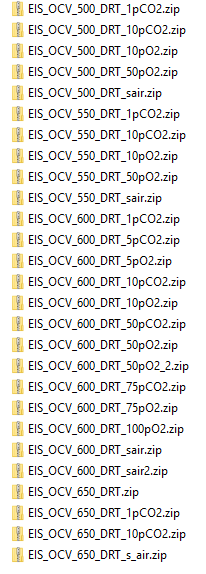

       

## Temperature Dependence Analysis

This Program will extract data from multiple temperature ranges and calculate values such as z prime and z double prime
It will then place the data in a csv that can be used in graphing in the CSV graphing software available for download on my github

NOTE: When given the option to select a zip file, Mac users should instead select the `unzipped folder location` of their original zipped file and leave the final box BLANK. Otherwise, The program will not be able to read the zip file and call a critical error causing the program to crash(working on a fix in the future)

UPDATE: To use the New windows for both MAC and Windows make sure to clone version 2.0 and run `TDV2.py`

## Getting Started and Important Notes
NOTE: Please see Images below for information regarding the correct files to give the program

Files MUST be zipped in a folder for correct deployment Ex. `EIS_OCV_..._EXAMPLE.zip` this is NOT needed in `TDV2.py`

On startup, the user will be prompted for a folder of MDAT Files. this program can handle MDATS, ZIPPED folders, and UNZIPPED folders.
each file in the folder should be a Temperature for a specific material. For example `EIS_OCV_500_DRT_1pCO2.zip` or `EIS_OCV_500_DRT_1pCO2.mdat` would be given that contains .mpro, .cor, and .z files. see images below for more information.

Once You have successfully put all your files in a folder and selected `start` on the main window the program is ready to analyze the data

### Prerequisites

Programs and other things needed to run this program
```
Python 3.x
Pip
```

### Installing

A step by step series of examples that tell you how to get a development env running

Automatic Method

`pip install -r requirements.txt`

Manual Method
```
pip install pandas 
pip install PySimpleGUI
pip install bokeh
pip install np
```

## Running the program

The best way to install and run the program is to clone this repo to your home directory by typing `git clone https://github.com/Jobenland/Temperature-Dependence-Analysis`. Once the directory has been cloned, change the directory `cd Temperature-Dependence-Analysis` to the directory of the repository. Ensure you are in the directory by typing `dir` and checking the output for a file called `TCPV2`. Type `python --version` or `python3 -version` and ensure the output version is at least 3.x.

Once you have checked the python version the program can be ran by typing `python TCPV2.py` *see screenshots for more info* and you should be given a UI with a box to select the folder of your files *see "Getting Started and Important Notes" for more info regarding file types* select the folder location and hit `start` once start is selected a debug window will appear giving information on the current state of the program. Next, a new window will come up asking for the area, type in a number that is HALF of your actual area. for example, for an area that is `0.31` enter `0.155`. Once area has been entered select `ok` and the program will output a progress bar *this may take a while depending on amount of data given* once this runs and completes it will show one last popup asking for a combined excel file name. This program compiles all data for all temps and materials into one xlsx file with various sheets *for sheet name problems see FAQ* After it ammends data to the new file, the program will indicate it is complete with a popup stating `complete` and the user can hit `ok` to terminate the program.

Once the program is completed, The user should check the output. navigate yourself to the `Extracted_z_and_csv` folder and look for the xlsx file you named in the previous step. Two CSV's are generated by each z file with one of them ending in `DRTPre-Processing` this file can be ignored or deleted as it is used with another program. If this folder does not exist and or the data in it is incorrect see FAQ

## FAQ
PLEASE CHECK HERE BEFORE CONTACTING ME ON ISSUES. MOST OF THEM ARE SIMPLY SYNTAX ERRORS THAT CAN BE EASILY SOLVED

The extracted z and csv folder is not there. How can I fix this? -->
    *est way to fix this is by ensuring you are looking in the right directory and restarting the program*
    
The filenames in the combined excel file are not correct? -->
    *This program works by taking the `EIS_OCV` out of the file name, taking the next 3 words `500_DRT_1pCO2` and then purging the rest       to fix this rename your files using this naming convention*
    
Im getting an error `no module found ___` -->
    *enter `pip install _____` in your command prompt and restart the program*
    
Im getting other errors and I believe it did not give out the right information -->
    *submit an issue with good information regarding your problem and I will try to fix is as soon as possible*

## Deployment

The best way to deploy this software for use in lab is to run locally either through command prompt or a Python Interpreter of your own

NOTE: running through command prompt or terminal will result in faster completion that debugging through a code editor

## Images


## Built With

* [Pandas](https://pandas.pydata.org/) - Used to edit and read CSV's
* [PySimpleGUI](https://pypi.org/project/PySimpleGUI/) - Used to create a GUI more efficiently
* [TKinter](https://docs.python.org/3/library/tkinter.html) - Used as backend GUI framework and support
* [Bokeh](https://bokeh.pydata.org/en/latest/) - Used as plotting software for the plot function
* [NP](http://cs231n.github.io/python-numpy-tutorial/) - Help with scientific calculations

## Contributing

If any Enhancements, Features or Problems arrise, Please submit a request on github

## Versioning

No versioning control has been set up yet but I am working on having this work in the Future 

## Authors

* **Jonathan Obenland** - *Initial work* - [Jonathan Obenland](https://github.com/jobenland)

## License

This project is licensed under the GPL License
